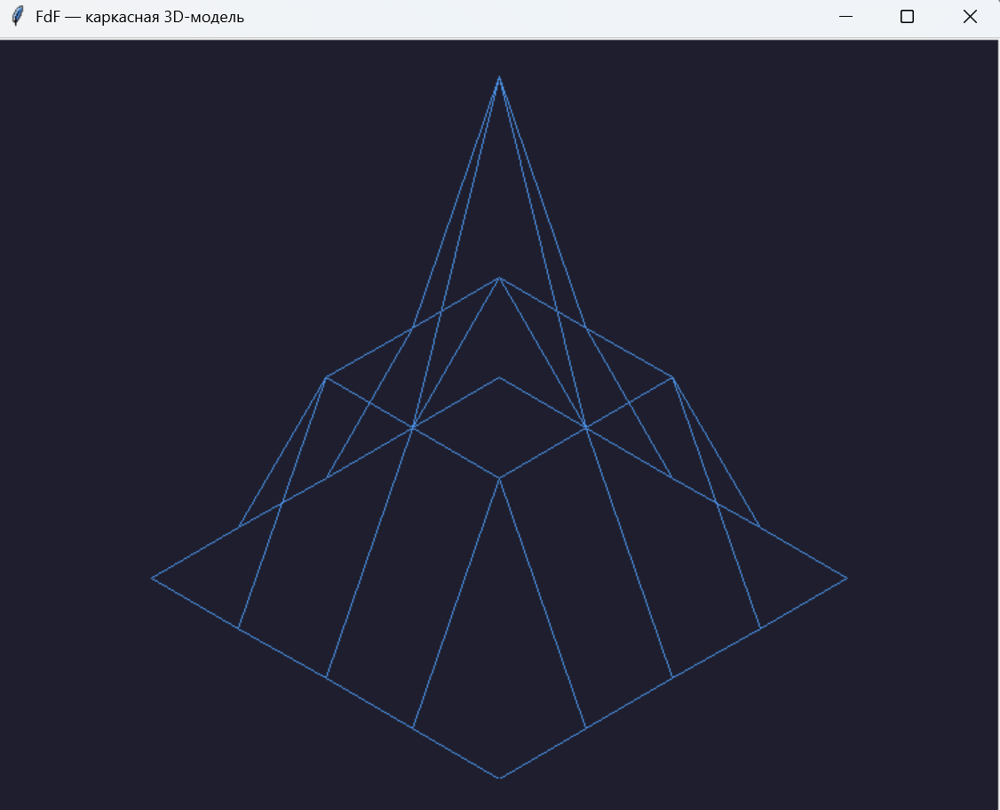

# FdF — каркасная 3D-модель карты высот

## Описание
Программа читает текстовый файл карты высот в формате .fdf и отображает её каркасную (wireframe) 3D-модель в изометрической проекции. Написана на чистом Python с использованием встроенной библиотеки tkinter для рендеринга, без применения сторонних 3D-движков.

## Установка и запуск
Для работы требуется интерпретатор Python 3.12 или новее.

1. Рекомендуется создать и активировать виртуальное окружение:
   python -m venv venv
   # Для Windows:
   venv\Scripts\activate

2. Установите зависимости (требуются только для запуска тестов и линтеров):
   pip install pytest pytest-cov mypy ruff

3. Запустите программу, передав путь к файлу карты:
   python main.py map.fdf

## Управление
| Клавиша | Действие |
|---|---|
| Esc | Закрыть программу |

## Формат карты
Файл карты состоит из строк с целыми числами, разделёнными пробелами. Позиция числа в строке — это координата x, а номер строки — координата y.

Пример карты 5x5:
0 0 0 0 0
0 2 2 2 0
0 2 5 2 0
0 2 2 2 0
0 0 0 0 0

## Структура проекта
* main.py — точка входа в приложение.
* fdf/parser.py — парсинг файла карты.
* fdf/model.py — ООП-представление карты высот.
* fdf/projection.py — математика изометрической проекции.
* fdf/app.py — графический интерфейс на tkinter.

## Тесты
Для локального запуска проверок используйте следующие команды:
python -m pytest -v
python -m mypy --strict .
python -m ruff check .

# Лицензия
Проект распространяется под лицензией MIT.